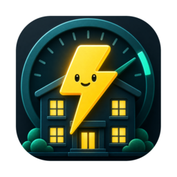
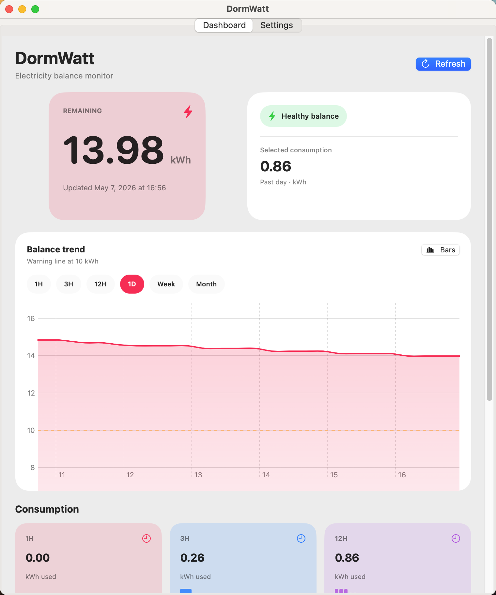
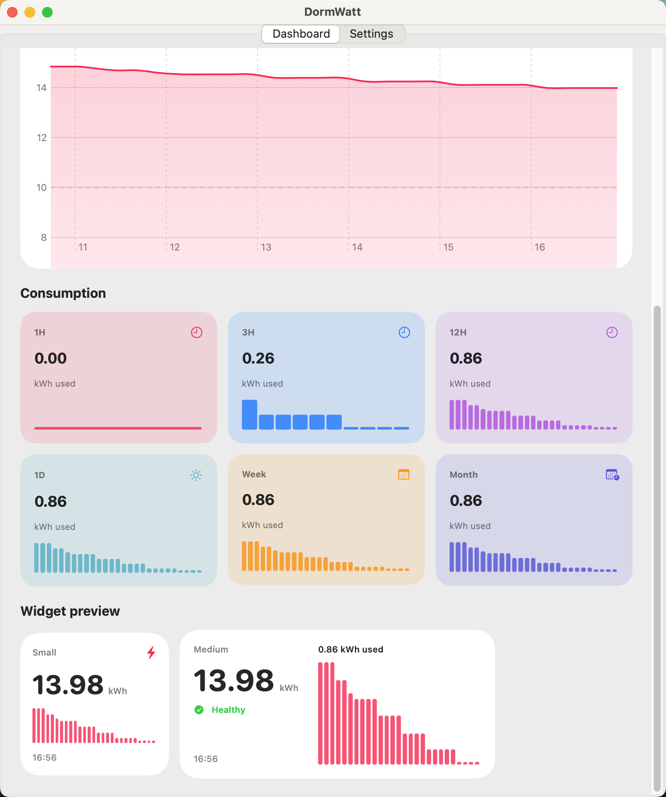
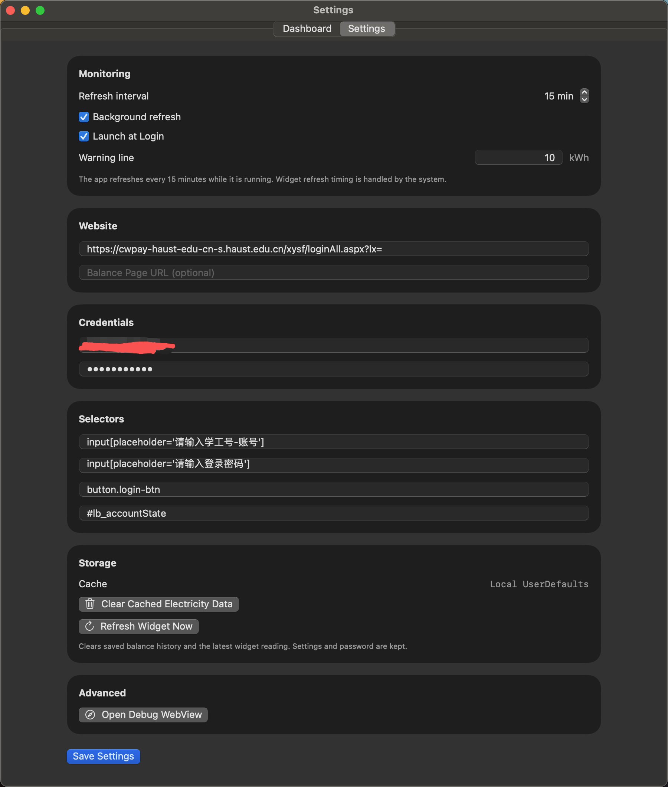
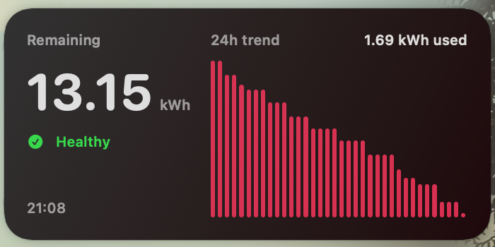

# DormWatt



**DormWatt is an iOS / macOS SwiftUI utility for checking dorm electricity balance at Henan University of Science and Technology.**

The goal is modest and practical: reduce a repetitive lookup flow from opening a portal, signing in, navigating pages, and finding the balance to a refresh button and a widget. DormWatt does not bypass authentication, avoid platform rules, or perform bulk requests. It only reads balance text that is already visible to the signed-in user on their own device.

[中文 README](README.md)

## Preview

|  |  |
| :---: | :---: |
| <br/>**Dashboard (top)** | <br/>**Dashboard (bottom)** |
| <br/>**Settings** | <br/>**Widget** |

## Motivation

Dorm electricity balance is useful but repetitive to check manually. DormWatt turns that process into a configurable local workflow and a quick widget glance.

This is primarily a learning and productivity project. The interesting parts are SwiftUI, WidgetKit, WKWebView, Keychain, local persistence, and app-widget data sharing rather than changing how the original payment system works.

## Features

- Configurable login URL, balance page URL, and CSS selectors
- Local web flow powered by WKWebView
- Password storage through Keychain
- App Group UserDefaults shared between app and widget
- Local balance history, trends, and low-balance status
- iOS / macOS widget for quick access
- Optional in-app interval refresh
- Cache clearing without deleting settings or Keychain password

## Compliance

- DormWatt is not an official app of Henan University of Science and Technology.
- It is intended for personal learning, personal devices, and convenience.
- Use only accounts you are authorized to access.
- Respect campus and payment-platform rules.
- Avoid high-frequency refreshes; the default interval is 15 minutes.
- The repository does not contain real accounts, passwords, cookies, tokens, or personal balance data.

## Technical Approach

1. Build a multi-platform iOS / macOS interface with SwiftUI.
2. Save portal URL, username, and CSS selectors from the Settings screen.
3. Store the password in Keychain instead of plain UserDefaults.
4. Load the configured portal with WKWebView and run the local signed-in flow.
5. Locate balance text with the configured selector and parse the numeric value locally.
6. Save the latest balance and local history.
7. Let WidgetKit read cached data through an App Group.
8. Ask WidgetKit to refresh the timeline after a successful app refresh.

## Default Configuration

The public repository does not include any personal account or password. The following values are a starting point for the HAUST dorm electricity lookup flow. If the portal changes, inspect the page structure with the debug view and update selectors.

| Field | Default / Example |
| --- | --- |
| Login URL | `https://cwpay-haust-edu-cn-s.haust.edu.cn/xysf/loginAll.aspx?lx=` |
| Balance Page URL | empty |
| Username selector | `input[name='username']` |
| Password selector | `input[type='password']` |
| Login button selector | `button[type='submit']` |
| Balance text selector | `#balance` |
| Refresh interval | `15` minutes |
| Low balance threshold | `5` |

## Build

### Requirements

- Xcode 14 or later
- iOS 16.4 / macOS 13 deployment targets or later
- An Apple Developer Team for local signing

### 1. Clone

```sh
git clone https://github.com/<your-name>/DormWatt.git
cd DormWatt
open DormWatt.xcodeproj
```

### 2. Configure Bundle IDs and App Group

The repository uses placeholder identifiers:

```text
com.example.DormWatt
com.example.DormWatt.Widget
group.com.example.DormWatt
```

Replace them with unique identifiers under your account, and keep the App Group identical between the main app and widget:

```text
com.yourname.DormWatt
com.yourname.DormWatt.Widget
group.com.yourname.DormWatt
```

Update:

- Bundle Identifier for the `DormWatt` target
- Bundle Identifier for the `DormWattWidget` target
- `DormWatt/DormWatt.entitlements`
- `DormWattWidget/DormWattWidget.entitlements`
- `DormWattSharedConfiguration.sharedDefaultsSuiteName`

### 3. Build and Test

Run the `DormWatt` scheme from Xcode.

Command-line build:

```sh
xcodebuild -project DormWatt.xcodeproj -scheme DormWatt -destination 'platform=macOS' build
```

Tests:

```sh
xcodebuild test -project DormWatt.xcodeproj -scheme DormWatt -destination 'platform=macOS' -only-testing:DormWattTests
```

## Usage

1. Open Settings.
2. Enter portal URL, username, password, and selectors.
3. Save settings.
4. Refresh from Dashboard.
5. Add the DormWatt widget to see the latest cached balance.

If the widget does not update, check that:

- The main app and widget use the same App Group.
- A successful refresh has written local history.
- The widget has been removed and added again after reinstalling.
- macOS is not still loading an old WidgetKit extension.

## Project Status

DormWatt is a hobbyist project for learning and local personal use. Portal URLs, page structures, and authentication flows may change, so long-term compatibility is not guaranteed.

Contributions are welcome when they keep the project compliant, low-frequency, and personal-use oriented.
