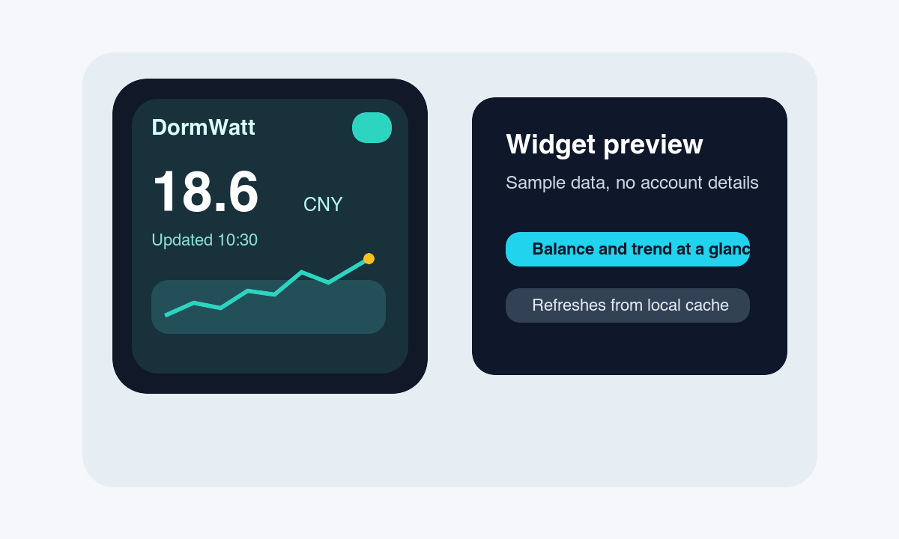

# DormWatt


DormWatt 是一个本机使用的 macOS 电费余额查看工具。它通过可配置的网页入口读取余额，把凭据保存在 macOS Keychain，把历史记录保存在本地，并提供通知中心小组件用于快速查看。



## 功能

- 可配置登录地址、余额页面地址和 CSS 选择器
- 本地余额历史记录、趋势展示和低余额提示
- 通知中心小组件，读取应用共享的本地缓存
- 应用运行时自动刷新
- 可选开机启动
- 设置页支持清除缓存数据

## 隐私

DormWatt 面向个人本机使用。密码存储在 macOS Keychain，余额历史存储在本地。本仓库不包含真实凭据、真实门户地址或任何专属配置。

## 配置

打开设置页后填写：

- 登录地址
- 余额页面地址，如果你的入口需要单独的余额页面
- 用户名
- 用户名输入框、密码输入框、登录按钮和余额文本的 CSS 选择器
- 自动刷新间隔和低余额阈值

默认值都是公开占位符。使用刷新或小组件前，需要先填入你自己的网页配置。

## 小组件

小组件会从应用共享的本地容器读取最近一次保存的余额。如果小组件显示占位内容，请先打开应用并执行一次刷新，让本地缓存写入当前数据。

在 macOS Ventura 中，可以从通知中心的小组件编辑界面添加 DormWatt。

## 构建

用 Xcode 打开 `DormWatt.xcodeproj`，设置你自己的签名团队、Bundle Identifier 和 App Group，然后构建 `DormWatt` scheme。

命令行构建：

```sh
xcodebuild -project DormWatt.xcodeproj -scheme DormWatt -destination 'platform=macOS' build
```

如果启用 App Groups，请确保主应用和小组件的 entitlements 使用同一个 App Group 标识。
