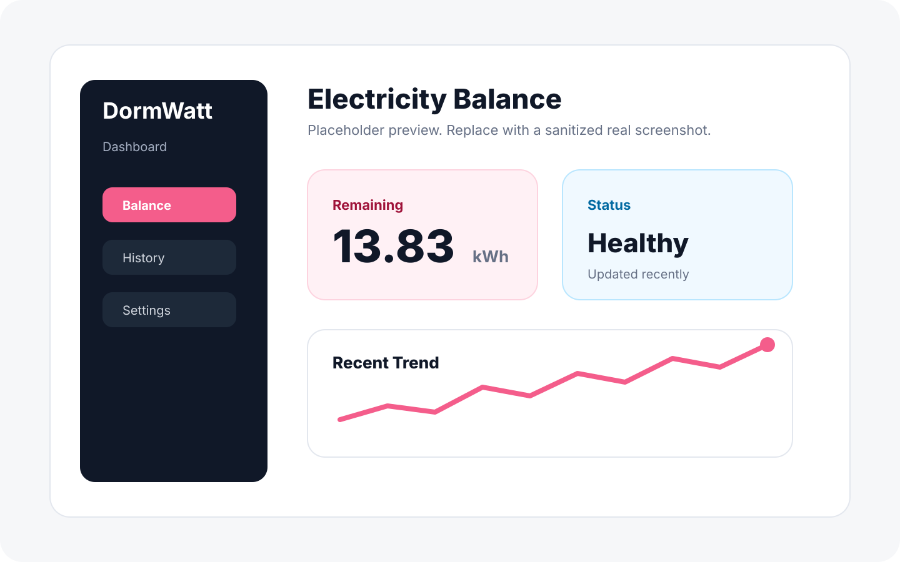
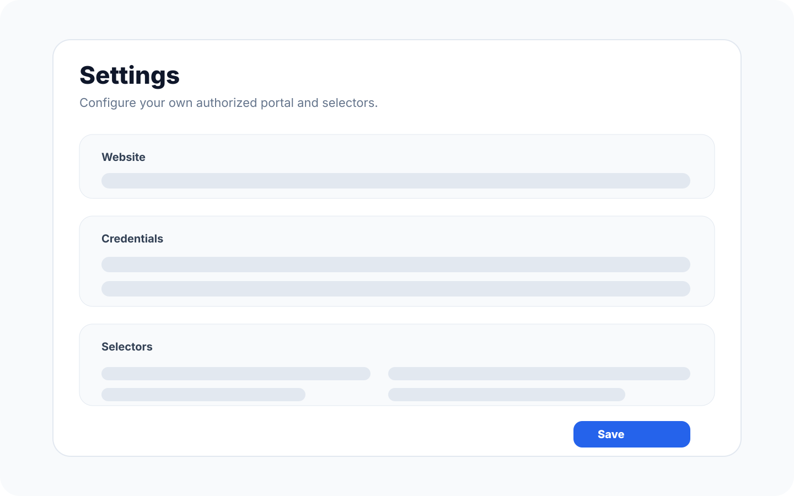
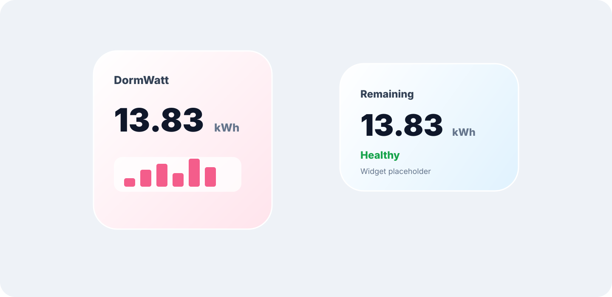

# DormWatt


**DormWatt 是一个面向河南科技大学宿舍电费查询场景的 iOS / macOS SwiftUI 小工具。**

它的目标很简单：把日常查询宿舍剩余电费这件事从“打开入口、登录、进入页面、寻找余额”缩短为一次刷新和一个小组件。DormWatt 不提供任何绕过认证、批量请求或规避校园系统规则的能力；它只在用户本人配置入口、账号并完成授权后，在本机读取页面中已经可见的余额文本。

[English README](README.en.md)

## 展示

> 以下图片目前是占位图，避免提交真实账号、余额或校园门户截图。后续可以用真实脱敏截图替换同名文件。







## 为什么做这个

宿舍电费余额本身是一个高频但低复杂度的信息。手动查询通常需要多次点击、登录和等待页面加载。DormWatt 试图用一个本机客户端把这些步骤整理成可配置流程，让学生更方便地查看自己的余额和近期变化。

这个项目更接近一个学习和效率工具：我们关注 SwiftUI、WidgetKit、WKWebView、Keychain、本地缓存和桌面/移动端小组件之间如何协作，而不是改变或绕过原有业务系统。

## 功能

- 可配置登录入口、余额页面和 CSS 选择器
- 使用 WKWebView 在本机完成网页加载和登录流程
- 使用 Keychain 保存密码
- 使用 App Group UserDefaults 在主应用和小组件之间共享本地缓存
- 保存余额历史，展示趋势和低余额状态
- iOS / macOS 小组件快速查看最近余额
- 应用运行时可按间隔刷新
- 支持清除本地缓存，不清除账号配置和 Keychain 密码

## 合规说明

- DormWatt 不是河南科技大学官方应用，也不代表学校或缴费平台。
- 本项目仅用于个人学习、个人设备上的便捷查询和 SwiftUI 技术实践。
- 请只使用你本人有权访问的账号。
- 请遵守学校和缴费平台的使用规则。
- 不建议高频刷新；默认刷新间隔为 15 分钟。
- 项目不包含真实账号、密码、Cookie、Token 或个人余额数据。

## 技术路线

DormWatt 的主要技术路径如下：

1. SwiftUI 构建 iOS / macOS 多平台界面。
2. 设置页保存查询入口、账号和 CSS 选择器。
3. 密码通过 Keychain 保存，不写入仓库或普通配置文件。
4. WKWebView 加载用户配置的网页入口，在用户授权信息基础上执行本机查询流程。
5. 余额文本由可配置 CSS 选择器定位，再用本地解析器提取数值。
6. 查询结果写入本地历史记录和最近一次记录。
7. WidgetKit 小组件通过 App Group 读取最近数据并展示。
8. 主应用刷新成功后请求系统刷新小组件 timeline。

## 默认配置

公开仓库不会内置个人账号或密码。下面是河南科技大学宿舍电费查询场景下的参考起点，页面结构如果调整，需要自行用调试视图确认选择器。

| 配置项 | 默认/参考值 |
| --- | --- |
| Login URL | `https://cwpay-haust-edu-cn-s.haust.edu.cn/xysf/loginAll.aspx?lx=` |
| Balance Page URL | 留空 |
| Username selector | `input[name='username']` |
| Password selector | `input[type='password']` |
| Login button selector | `button[type='submit']` |
| Balance text selector | `#balance` |
| Refresh interval | `15` 分钟 |
| Low balance threshold | `5` |

如果你的环境中页面字段不同，请在应用的 Debug WebView 中观察页面结构后修改选择器。

## 构建

### 环境

- Xcode 14 或更高版本
- iOS 16.4 / macOS 13 或更高版本目标
- 一个用于本机签名的 Apple Developer Team

### 1. 克隆项目

```sh
git clone https://github.com/<your-name>/DormWatt.git
cd DormWatt
open DormWatt.xcodeproj
```

### 2. 修改 Bundle Identifier 和 App Group

公开仓库使用占位标识：

```text
com.example.DormWatt
com.example.DormWatt.Widget
group.com.example.DormWatt
```

你需要在 Xcode 中替换为自己的唯一标识，并确保主应用和小组件使用同一个 App Group。例如：

```text
com.yourname.DormWatt
com.yourname.DormWatt.Widget
group.com.yourname.DormWatt
```

需要同步修改：

- `DormWatt` target 的 Bundle Identifier
- `DormWattWidget` target 的 Bundle Identifier
- `DormWatt/DormWatt.entitlements`
- `DormWattWidget/DormWattWidget.entitlements`
- `DormWattSharedConfiguration.sharedDefaultsSuiteName`

### 3. 构建运行

在 Xcode 选择 `DormWatt` scheme 后运行。

命令行构建：

```sh
xcodebuild -project DormWatt.xcodeproj -scheme DormWatt -destination 'platform=macOS' build
```

测试：

```sh
xcodebuild test -project DormWatt.xcodeproj -scheme DormWatt -destination 'platform=macOS' -only-testing:DormWattTests
```

## 使用

1. 打开 Settings。
2. 填写登录入口、用户名、密码和选择器。
3. 保存设置。
4. 在 Dashboard 点击刷新。
5. 添加 DormWatt 小组件查看最近余额。

如果小组件不更新，可以先确认：

- 主应用和小组件的 App Group 完全一致。
- 查询成功后本地历史记录已有新数据。
- 小组件已被移除并重新添加过一次。
- macOS 上 Notification Center / WidgetKit 没有加载旧版本扩展。

## 项目状态

这是一个技术爱好者项目，主要服务个人学习和本机使用。页面结构、学校系统入口和认证流程可能变化，因此项目不会保证长期适配所有环境。

欢迎基于合规、低频、个人使用的前提改进代码和文档。
